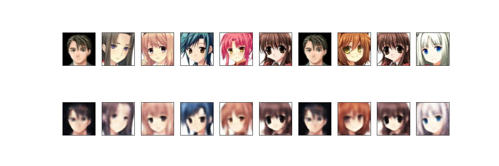

# Variational_AutoEncoder

A sample VAE model architecture looks:

**`VAE_Mnist.ipynb`** shows processes in details that how to build a VAE model and train it on `MNIST` dataset.
When we set the **latent dimension** as `2`, the latent pattern of image categories can be visuailized in 2d plot, together with the reconstructed image, shown as, 

**`VAE_Anime.ipynb`** is similar as above but trained on dataset of [anime faces dataset by MckInsey666](https://github.com/bchao1/Anime-Face-Dataset). The VAE model will be a little bit of complex than the former (e.g., three conv2d block in encoder). The latent dimension is set as `512`. The reconstructured image is,

